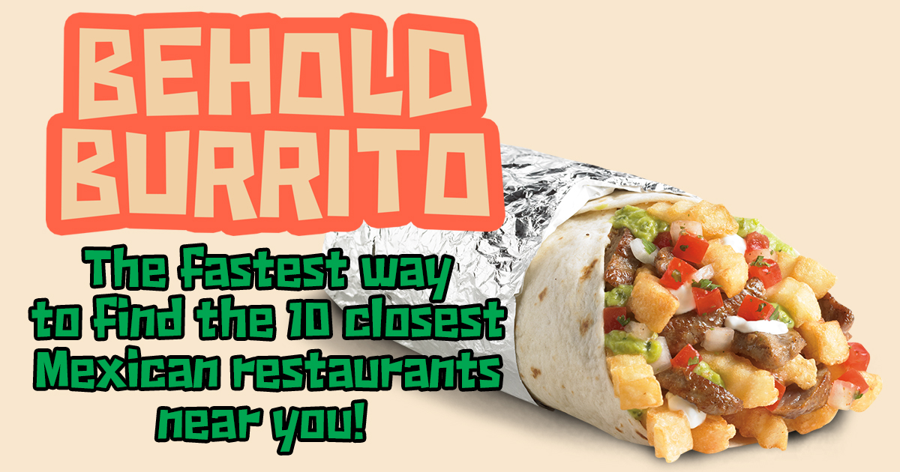

# Behold Burrito

## Live @ [beholdburrito.herokuapp.com](https://beholdburrito.herokuapp.com)

[](https://beholdburrito.herokuapp.com/)

**Behold Burrito** is a Full Stack Web App created to quickly show a user the 10 closest Mexican restaurants to their current location.

The site is 100% ad free, and designed for ease of use, so users can find their feast fast!

[](https://beholdburrito.herokuapp.com/)

## Features

Users are able to:

* After allowing the site to access to their geolocation, the app automatically loads the 10 closest Mexican restaurants in proximity to the user.

This is accomplished by:

* Making a call to the Foursquare API based on the latitude and longitude of the user
  * This is queried in a way to return only the ten closest Mexican restaurants, listed in ascending order by distance in meters
* Making a call to the Mapbox API based off the returned data from Foursquare
* Displaying this to the user via a generated Mapbox map on the top half of the screen
  * The red pin is the user's current location
  * The blue pins are the discovered locations 
  * The blue pins can be clicked to reveal a data popup displaying the name of the restaurant and its specific address
    * These popups can be dismissed by an X button in the upper right, or can be swapped by clicking a new blue pin
* Below the map is a list of all the discovered Mexican restaurants in ascending order
  * Each list item is also a link to a google search run on the restaurant's name - with the goal of giving the user the website for the restaurant, or more information via the google search database

## Future Features

* An input for users who don't wish to or can't share their geolocation - so they can manually enter a search

## Technical Milestones

* Utilizing the Foursquare API
* Utilizing the Mapbox API
* Handling faults with react-map-gl npm package
* Obscuring/blocking secret API keys/tokens from malicious users
* Displaying multiple pins on a generated map after a call to a separate external API

## Technologies Used

* **Node.js & Express.js** For the HTTP backend server
* **React.js** For the front-end/client interface of my app
* **Foursquare API** To handle all exploration data requests
* **react-map-gl** For generating the map within a React project
* **Mapbox API** The API being called by react-map-gl
* **CSS3**

## Local Setup

**NOTE: This repo has been configured for deployment on Heroku, but can be run locally after a few adjustments.**

You must install [Node.js](https://nodejs.org) in your computer.

You can check for these dependencies with `node -v`. If your shell/terminal doesn't complain and you see version numbers you are good to go.

1. Clone this repo into a folder of your choice:
    ```
    git clone https://github.com/DouglasMacKrell/foursquare-app.git
    ```

2. Install dependencies for the Node/Express Server:
    ```
    cd backend && npm install
    ```

3. Install dependencies for the React App (`client` folder):
    ```
    cd ../frontend && npm install
    ```

4. To launch the Node/Express server, inside the `backend` folder run:
    ```
    cd ..
    npm start
    ```

5. Before you can launch the React App, you must target your local server within App.js that use this connection for axios calls. In the `frontend` => `src` folder, open the `App.js` file.

    - On line 54, change  
        ```
        `https://beholdburrito.herokuapp.com/api/venues/${latLong}`
        ```

    - to  
        ```
        `http://localhost:3001/api/venues/${latLong}`
        ```


6. To launch the React App, inside the `frontend` folder, and preferably in another terminal window run:
    ```
    npm start
    ```

7. A new browser tab should have been opened and the App should be running. If that is not the case check the terminals output for errors, if you are unable to troubleshoot the problem, I would be happy to address issues so open [one](/issues)

8. NOTE: You must secure your own API keys & tokens from Foursquare and Mapbox. The Mapbox token used here will only work for https://beholdburrito.herokuapp.com. At time of writing both have free developer accounts with no money/credit card info up front. Store your Foursquare keys in an .env file in the backend and swap out your Mapbox accessToken for the one I list in the frontend.

---

### Please check out my other work at [DouglasMacKrell.com](https://douglasmackrell.com)

---

[](https://dougmackrell.com)

** **

<details>
    <summary>
        Before you leave, please take note:
    </summary>

You're the best! Thank you for visiting!

Please give this project a star and be sure to check out my [YouTube Channel](https://youtube.com/BigMacKrell)!

</details>
